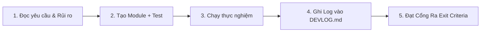

# 📜 QUY CHUẨN DỰ ÁN (PROJECT RULES & STANDARDS)
**Dự án:** Hệ thống OCR và Hỗ trợ Dịch Tiếng Lào cho Giáo dục Trực tuyến  
**Môn học:** Xử lý ảnh (Digital Image Processing)  
**Phiên bản:** 1.0.0

---

## 1. ⚠️ NGUYÊN TẮC BẤT DI BẤT DỊCH VỀ TIẾNG LÀO (THE LAO GOLDEN RULES)

Tiếng Lào là chữ viết dạng Abugida (thuộc ngữ hệ Brahmic), có cấu trúc **4 tầng độ cao** (dấu trên, phụ âm chính, nguyên âm dưới/trên, dấu thanh) và **không có khoảng trắng giữa các từ**. Mọi module trong hệ thống bắt buộc phải tuân thủ nghiêm ngặt 3 quy tắc sau:

1. **Chuẩn hóa Unicode NFC ở MỌI điểm vào/ra (MANDATORY NFC):**
   - Không bao giờ so sánh chuỗi, tính CER, tra từ điển hoặc lưu nhãn mà chưa chạy qua `src.preprocessing.normalize.normalize_lao(text)`.
   - Tiếng Lào có các tổ hợp phụ âm + nguyên âm + dấu thanh có thể được biểu diễn bằng nhiều chuỗi byte Unicode khác nhau. Bắt buộc ép về chuẩn NFC và sắp xếp lại thứ tự tổ hợp chuẩn:
     $$\text{Phụ âm} \rightarrow \text{Nguyên âm trên/dưới} \rightarrow \text{Dấu thanh}$$
   - Xử lý các nguyên âm đứng trước về mặt hiển thị: `ເ` (U+0EC0), `ແ` (U+0EC1), `ໂ` (U+0EC2), `ໃ` (U+0EC3), `ໄ` (U+0EC4).

2. **Kiểm tra Render Font trước khi sinh/huấn luyện (FONT VALIDATION FIRST):**
   - Tuyệt đối không sinh dữ liệu tổng hợp (P2c) hay huấn luyện mô hình (P7) với font chưa vượt qua bài kiểm tra render ở P0.
   - Font lỗi dấu (dấu thanh bị bay, đè lên phụ âm, hoặc mất nguyên âm tầng 3/4) sẽ đầu độc toàn bộ mô hình nhận dạng.

3. **Cấm dùng Morphological Kernel lớn:**
   - Các phép toán hình thái học (Morphology Opening/Closing) với kernel $\ge 3 \times 3$ thường xóa sạch dấu thanh (Tone marks) và dấu chấm nhỏ của tiếng Lào. Chỉ dùng kernel $1 \times 1$ hoặc $2 \times 2$ có kiểm soát.

---

## 2. QUY CHUẨN MÃ NGUỒN & CÔNG NGHỆ (CODE STANDARDS)

- **Môi trường & Ngôn ngữ:** Python 3.10+ (khuyến nghị 3.10 hoặc 3.11).
- **Format & Linter:** PEP 8, Type Hints đầy đủ trên mọi hàm public (`def func(x: np.ndarray) -> str:`).
- **Docstring:** Google Style hoặc NumPy Style, ghi rõ shape của ảnh `(H, W)` hoặc `(H, W, C)` và kiểu dữ liệu `uint8` hay `float32`.
- **Cấu trúc Pipeline Hướng cấu hình (Config-Driven):**
  - Mọi thao tác tiền xử lý, OCR, hậu xử lý đều phải đọc tham số từ file cấu hình (YAML hoặc `dataclass`).
  - Không hardcode ngưỡng (threshold), kernel size hay đường dẫn trong mã logic. Phải cho phép bật/tắt từng bước phục vụ Ablation Study (P5).
- **Pure Function & Không Side-Effect:** Các hàm xử lý ảnh nhận ảnh đầu vào `np.ndarray`, trả về ảnh mới, không biến đổi trực tiếp trên ảnh gốc (inplace mutate).

---

## 3. QUY CHUẨN THỰC NGHIỆM & KHOA HỌC (EXPERIMENT & METRICS)

- **Độ lặp lại (Reproducibility):** Cố định `seed = 42` (hoặc cấu hình) cho NumPy, PyTorch, Random ở tất cả các script.
- **Thước đo chuẩn:**
  - **CER (Character Error Rate):** Tính theo khoảng cách Levenshtein cấp ký tự sau khi đã chuẩn hóa NFC.
  - **WER (Word Error Rate):** Áp dụng cho các cụm từ/câu.
  - **Word Accuracy:** Tỉ lệ nhận dạng chính xác $100\%$ toàn bộ từ.
  - **Bootstrap Confidence Interval 95%:** Mọi bảng so sánh chính (Baseline, Ablation, Post-processing) phải đi kèm khoảng tin cậy 95% để chứng minh sự cải thiện có ý nghĩa thống kê ($p < 0.05$).
- **Nguyên tắc Đóng băng Dữ liệu (Data Leakage Prevention):**
  - Tập Gold Test Set (P2a) phải được chốt và đóng băng (Frozen).
  - Nghiêm cấm nhìn vào Test Set để tinh chỉnh tham số tiền xử lý. Mọi tối ưu hóa ở P3/P5 chỉ được thực hiện trên Dev Set (30%).

---

## 4. QUY TRÌNH LÀM VIỆC THEO PHÁT THẢO TỪNG CHÚT (STEP-BY-STEP CADENCE)

Mỗi Phase phải tuân theo vòng lặp 5 bước:

1. **Trước khi code:** Cập nhật trạng thái trong `docs/PROGRESS_TRACKER.md` sang `IN_PROGRESS`.
2. **Trong khi code:** Viết unit test đi kèm (ví dụ: test normalize NFC, test CER).
3. **Chạy & Đánh giá:** Ghi nhận số liệu vào thư mục `experiments/results/`.
4. **Sau khi xong:** Viết tóm tắt, số liệu, bài học vào `docs/DEVLOG.md` và kiểm tra **Cổng ra (Exit Gate)** của Phase.
5. **Chỉ chuyển phase** khi Cổng ra đã đạt 100%. Không làm dở dang nhảy cóc.
