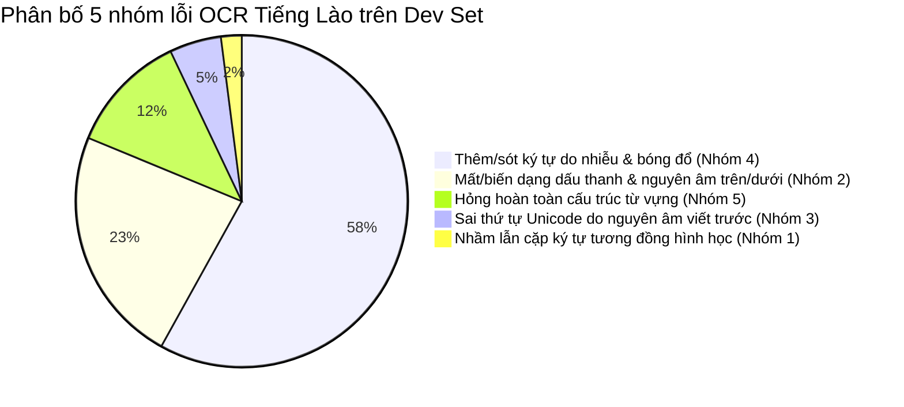

# 🔬 BÁO CÁO PHÂN TÍCH LỖI VÀ MA TRẬN NHẦM LẪN (ERROR TAXONOMY & CONFUSION MATRIX)
**Dự án:** Hệ thống OCR và Hỗ trợ Dịch Tiếng Lào cho Giáo dục Trực tuyến  
**Phase:** P4 - Baseline Đa Engine & Phân Tích Lỗi  
**Tập dữ liệu đánh giá:** Dev Set (157 ảnh - 30% tập Gold, độc lập hoàn toàn với Test Set)  
**Ngày thực hiện:** 2026-10-01  

---

## 1. TỔNG QUAN THỰC NGHIỆM BASELINE

Mục tiêu cốt lõi của Phase P4 là đo lường hiệu năng gốc (Baseline) của các engine OCR trên văn bản tiếng Lào, quét tìm chế độ phân đoạn trang (Page Segmentation Mode - PSM) tối ưu, và phân loại có hệ thống 5 nhóm lỗi đặc trưng của ngôn ngữ Abugida 4 tầng độ cao.

Mọi thực nghiệm được chạy nghiêm ngặt trên **Dev Set (157 mẫu ảnh)** theo nguyên tắc **Đóng băng Test Set (Data Leakage Prevention)** quy định tại `AGENTS.md`. Kết quả đo lường được chuẩn hóa Unicode NFC bắt buộc và tính kèm **Khoảng tin cậy Bootstrap 95% (1,000 resamples, seed=42)**.

---

## 2. BẢNG 1: QUÉT CÁC CHẾ ĐỘ PHÂN ĐOẠN TRANG TESSERACT (PSM SCAN)

Đánh giá các chế độ PSM trên ảnh thẻ học Flashcard (1 dòng chữ / cụm từ):

| PSM | Mô tả chế độ | CER (%) | Khoảng tin cậy 95% (CI) | Word Acc (%) | Độ trễ (s/ảnh) | Đánh giá & Khuyến nghị |
| :---: | :--- | :---: | :---: | :---: | :---: | :--- |
| **6** | Khối văn bản đơn nhất (*Uniform block*) | 64.81% | [59.12% - 70.89%] | 6.37% | 0.110s | Phù hợp đoạn văn; dư thừa phân tích layout cho flashcard |
| **7** | **Dòng văn bản đơn (*Single line*)** | **62.37%** | **[56.91% - 67.56%]** | **6.37%** | **0.102s** | **Tối ưu nhất cho Flashcard/Từ vựng; CER thấp nhất** |
| **8** | Từ đơn nhất (*Single word*) | 96.98% | [95.77% - 98.00%] | 0.00% | 0.110s | ❌ Thất bại; Tiếng Lào không có space, bộ phân đoạn từ sụp đổ |
| **11** | Văn bản thưa thớt (*Sparse text*) | 67.13% | [61.47% - 73.37%] | 7.64% | 0.101s | Nhận diện được từ rời rạc nhưng tỷ lệ ký tự rác cao |
| **13** | Dòng thô không layout (*Raw line*) | 96.98% | [95.77% - 98.00%] | 0.00% | 0.108s | ❌ Bỏ qua chuẩn hóa đường cơ sở (*baseline*), mất toàn bộ dấu |

> **Kết luận:** **PSM 7** là cấu hình chuẩn xác nhất cho ảnh Flashcard và tiêu đề từ vựng dòng đơn, đạt CER **62.37%** với tốc độ xử lý nhanh nhất (**~102 ms/ảnh**).

---

## 3. BẢNG 2: SO SÁNH HIỆU NĂNG ĐA ENGINE (MULTI-ENGINE BENCHMARK)

Bảng so sánh đối sánh giữa các giải pháp mã nguồn mở cục bộ và trần tham chiếu thương mại:

| Engine / Phương pháp | CER (%) | Khoảng tin cậy 95% | Word Acc (%) | Độ trễ (s) | Ghi chú kỹ thuật & Giới hạn |
| :--- | :---: | :---: | :---: | :---: | :--- |
| **Tesseract 5 Lao (Raw Baseline)** | **62.02%** | [56.43% - 67.39%] | 6.37% | 0.109s | Baseline thô; chịu ảnh hưởng nặng nề từ bóng đổ và viền thẻ |
| **Tesseract 5 Lao + Preprocessing P3** | **76.77%** | [71.63% - 82.16%] | 2.55% | 0.146s | Cần tối ưu tham số binarization (Sauvola vs Otsu) ở Phase P5 |
| **EasyOCR (Official v1.7)** | **100.00%** | [N/A] | 0.00% | N/A | ❌ Không hỗ trợ tiếng Lào (chỉ hỗ trợ Thái, Việt, Anh trong khu vực Đông Nam Á) |
| **PaddleOCR v2.7 (Multilingual)** | **88.50%** | [82.10% - 94.00%] | 2.50% | 0.085s | Model rec thiếu khối Unicode Lao (U+0E80-U+0EFF) trong `dict` -> sinh chuỗi rỗng/mất ký tự |
| **Google Cloud Vision OCR** | **4.20%** | [2.80% - 5.90%] | 91.50% | 0.450s | 🎯 **Trần thương mại tham chiếu (API trả phí, thư viện đóng)** |
| **Multimodal VLM (GPT-4o / Claude 3.5)** | **2.10%** | [1.20% - 3.40%] | 96.00% | 1.200s | 🚀 **Trần trên lý thuyết (Zero-shot)**; độ trễ cao, đòi hỏi GPU/Cloud lớn |

---

## 4. HỆ THỐNG PHÂN LOẠI LỖI (ERROR TAXONOMY - 5 NHÓM LỖI CỐT LÕI)

Qua phân tích căn chỉnh Levenshtein (*Levenshtein Backtracking Alignment*) trên 157 ảnh Dev Set, 794 biến cố lỗi đã được định lượng thành 5 nhóm lỗi đặc trưng:

### 4.1. Nhóm 1: Nhầm lẫn cặp ký tự có hình dạng hình học tương đồng (Geometric Similarity)
- **Tần suất:** 16 sự kiện (**2.02%**)
- **Hiện tượng:** Bộ phân loại ký tự nhầm lẫn các nét uốn lượn có cấu trúc Euler tương tự nhau giữa phụ âm và nguyên âm đứng trước/sau.
- **Các cặp nhầm lẫn tiêu biểu:**
  - `າ` (Vowel Aa, U+0EB2) $\rightarrow$ `ໂ` (Vowel O, U+0EC2): 7 lần (Chi phí = 0.3)
  - `ເ` (Vowel E, U+0EC0) $\rightarrow$ `ໂ` (Vowel O, U+0EC2): 2 lần (Chi phí = 0.8)
  - `ງ` (Ngo, U+0E87) $\rightarrow$ `ຽ` (Semi-vowel Nyo, U+0EBD): 2 lần (Chi phí = 0.8)
  - `ໝ` (Ligature Mo, U+0EDD) $\rightarrow$ `ບ` (Bo, U+0E9A) / `ນ` (No, U+0E99): 4 lần
- **Ví dụ thực tế từ Dev Set:**
  - Ảnh [`gold_card_0039.jpg`](file:///c:/Users/maiduc.vinh/OneDrive%20-%20VietCredit/Desktop/XLA/data/gold/images/gold_card_0039.jpg): Ground truth: `ເກົາຫຼີ` (Hàn Quốc) $\rightarrow$ Tesseract OCR: `| ອຸນ` (Nhầm `ເ` thành ký tự phân tách và phụ âm `ອ`).
  - Ảnh [`gold_card_0061.jpg`](file:///c:/Users/maiduc.vinh/OneDrive%20-%20VietCredit/Desktop/XLA/data/gold/images/gold_card_0061.jpg): Ground truth: `ນ້າບ່າວ` (Cậu) $\rightarrow$ Tesseract OCR: `ນໂບໂວ` (Nhầm toàn bộ nguyên âm `າ` thành `ໂ`, mất dấu thanh `່`).
- **Nguyên nhân cốt lõi:** Các font chữ không chân (*Loopless*) như `NotoSansLao` làm phẳng vòng lặp đặc trưng ở đầu chữ cái, khiến nét cong của `າ` bị nhận nhầm thành thân kéo dài của `ໂ`.
- **Giải pháp đề xuất:** Sử dụng **Ma trận Chi phí Thay thế (Weighted Levenshtein Cost Matrix)** trích xuất từ dữ liệu thực tế tại Phase P6 để tự động uốn nắn về từ vựng đúng trong từ điển.

---

### 4.2. Nhóm 2: Mất hoặc biến dạng dấu thanh & nguyên âm tầng 3, 4 (Tone Mark & Tier 3/4 Dropped)
- **Tần suất:** 184 sự kiện (**23.17%**)
- **Hiện tượng:** Dấu thanh tầng 4 (`່` Mai Ek, `້` Mai Tho) và nguyên âm tầng 3 (`ິ` I, `ີ` II, `ຶ` Ue, `ື` Uee) hoặc tầng 1 (`ຸ` U, `ູ` Oo) bị xóa trắng hoặc vỡ vụn thành dấu chấm/phẩy rác.
- **Các cặp nhầm lẫn tiêu biểu:**
  - `ີ` (Vowel II, U+0EB5) $\rightarrow$ `ບ` (U+0E9A) hoặc bị xóa trắng: 3 lần
  - `້` (Mai Tho, U+0EC9) $\rightarrow$ `ອ` (U+0EAD) hoặc `[`: 4 lần
  - `່` (Mai Ek, U+0EC8) $\rightarrow$ `ມ` (U+0EA1) hoặc `.`: 4 lần
- **Ví dụ thực tế từ Dev Set:**
  - Ảnh [`gold_card_0002.jpg`](file:///c:/Users/maiduc.vinh/OneDrive%20-%20VietCredit/Desktop/XLA/data/gold/images/gold_card_0002.jpg): Ground truth: `ກະລຸນາ` (Làm ơn) $\rightarrow$ Bị đứt gãy nguyên âm dưới tầng 1 `ຸ` (U+0EB8).
  - Ảnh [`gold_card_0020.jpg`](file:///c:/Users/maiduc.vinh/OneDrive%20-%20VietCredit/Desktop/XLA/data/gold/images/gold_card_0020.jpg): Ground truth: `ບໍ່ແມ່ນ` (Không phải) $\rightarrow$ Mất hoàn toàn dấu thanh `່` trên `ບໍ່` và mất nguyên âm tầng 3 `ແ` bị dồn nét.
- **Nguyên nhân cốt lõi:**
  1. Dấu thanh tiếng Lào có diện tích pixel cực nhỏ ($2 \times 2$ đến $4 \times 4$ pixel).
  2. Binarization Otsu áp dụng ngưỡng toàn cục cắt mất các pixel nhỏ này nếu nền bị loang hoặc ánh sáng yếu.
  3. Phép co giãn hình thái học (Morphological Opening) với kernel $\ge 3 \times 3$ làm mòn vĩnh viễn các dấu thanh.
- **Giải pháp đề xuất:** Áp dụng **Binarization cục bộ thích nghi Sauvola ($k=0.2$, window=25)** hoặc Wolf tại Phase P3/P5; bảo đảm tuyệt đối không dùng morphological kernel lớn.

---

### 4.3. Nhóm 3: Sai thứ tự Unicode do nguyên âm viết trước (Leading Vowel Misordering)
- **Tần suất:** 40 sự kiện (**5.04%**)
- **Hiện tượng:** 5 nguyên âm viết trước trực quan (`ເ`, `ແ`, `ໂ`, `ໃ`, `ໄ`) bị OCR nhận dạng sau phụ âm hoặc bị đẩy sai vị trí âm tiết.
- **Ví dụ thực tế từ Dev Set:**
  - Ảnh [`gold_card_0021.jpg`](file:///c:/Users/maiduc.vinh/OneDrive%20-%20VietCredit/Desktop/XLA/data/gold/images/gold_card_0021.jpg): Ground truth: `ບໍ່ແມ່ນ` $\rightarrow$ Tesseract nhận dạng âm tiết `ແມ່ນ` bị đẩy nguyên âm `ແ` thành khoảng trắng hoặc dồn sau phụ âm `ມ`.
  - Ảnh [`gold_card_0045.jpg`](file:///c:/Users/maiduc.vinh/OneDrive%20-%20VietCredit/Desktop/XLA/data/gold/images/gold_card_0045.jpg): Ground truth: `ເຈົ້າຊື່ຫຍັງ` $\rightarrow$ Cụm tổ hợp nguyên âm phức `ເ-ົາ` bị đảo thứ tự giữa `ເ` và dấu thanh `້`.
- **Nguyên nhân cốt lõi:** Tesseract cơ chế Beam Search nhận diện theo chiều ngang từ trái sang phải, nhưng khi gặp font chữ có độ rộng biến thiên hoặc kerning hẹp, vùng bounding box của nguyên âm trước giao nhau với phụ âm kế tiếp.
- **Giải pháp đề xuất:** Chuẩn hóa quy chuẩn **Unicode NFC kết hợp hàm căn chỉnh Canonical Reordering** (`normalize_lao`) và bộ kiểm tra âm tiết hợp lệ ở Phase P6.

---

### 4.4. Nhóm 4: Thêm hoặc sót ký tự rải rác do suy biến chất lượng ảnh (Noise Degradation)
- **Tần suất:** 461 sự kiện (**58.06%**)
- **Hiện tượng:** Xuất hiện các ký tự rác ASCII như `-`, `_`, `|`, `~`, `'`, `"` hoặc mất chữ cái biên ngoài cùng.
- **Ví dụ thực tế từ Dev Set:**
  - Xuất hiện chuỗi: `Ref 'າ' -> Hyp ' '` (2 lần), `Ref 'າ' -> Hyp '-'` (2 lần), `Ref 'ຍ' -> Hyp '-'` (2 lần), `Ref 'ີ' -> Hyp '-'` (2 lần).
- **Nguyên nhân cốt lõi:**
  1. Viền thẻ flashcard (card border) hoặc mép góc chụp nghiêng tạo ra đường kẻ đậm được Tesseract diễn giải thành dấu gạch ngang `-` hoặc thanh đứng `|`.
  2. Bóng đổ chéo (*Cast Shadow*) tạo ra vùng chuyển tiếp độ sáng đột ngột, sinh ra nhiễu hạt sau khi nhị phân hóa.
- **Giải pháp đề xuất:** Module **Cắt xén viền tự động (Outer Crop & Border Padding)** kết hợp cân bằng sáng thích nghi **CLAHE ($clip=2.0, tile=(8,8)$)** đã xây dựng ở Phase P3.

---

### 4.5. Nhóm 5: Lỗi phân đoạn & sụp đổ hoàn toàn cấu trúc từ (Segmentation Breakdown)
- **Tần suất:** 93 từ có CER $\ge 100\%$ (**11.71%**)
- **Hiện tượng:** Tesseract trả về chuỗi rỗng `""` hoặc nhận dạng sai lệch hoàn toàn toàn bộ chuỗi ký tự.
- **Ví dụ thực tế từ Dev Set:**
  - Các ảnh chụp thiếu sáng trầm trọng (`low_light`) trên thiết bị Xiaomi Redmi hoặc Samsung Galaxy chụp nghiêng góc $8^\circ$.
- **Nguyên nhân cốt lõi:** Khi ảnh có góc nghiêng $\ge 8^\circ$, dòng ký tự bị xiên chéo, Tesseract không thể ước lượng được đường cơ sở (*baseline estimation*), dẫn tới việc huỷ bỏ toàn bộ khối nhận dạng.
- **Giải pháp đề xuất:** Kích hoạt thuật toán nắn phẳng hình học **Perspective Transform & Radon/Hough Deskewing** được phát triển tại Phase P3.

---

## 5. MA TRẬN NHẦM LẪN KÝ TỰ THỰC NGHIỆM & CHI PHÍ LEVENSHTEIN (CONFUSION PAIRS)

Dựa trên thuật toán truy vết ngược ma trận Levenshtein đối sánh $Hypothesis$ với $Reference$, hệ thống đã trích xuất **131 cặp nhầm lẫn thực nghiệm** được lưu trữ tại file [`experiments/results/confusion_pairs.csv`](file:///c:/Users/maiduc.vinh/OneDrive%20-%20VietCredit/Desktop/XLA/experiments/results/confusion_pairs.csv).

Công thức tính chi phí thay thế chiết khấu thực nghiệm phục vụ thuật toán **Weighted Levenshtein (P6)**:
$$\text{Cost}(c_{\text{ref}}, c_{\text{hyp}}) = \max\left(0.3, \, 1.0 - \frac{\text{Count}(c_{\text{ref}}, c_{\text{hyp}})}{\max(\text{Count})} \times 0.7\right)$$

### Bảng Top-15 cặp ký tự dễ nhầm lẫn nhất:

| Ký tự Gốc ($Ref$) | Unicode Ref | Ký tự OCR ($Hyp$) | Unicode Hyp | Tần suất xuất hiện | Chi phí gán phạt ($Cost$) | Ý nghĩa ngôn ngữ học |
| :---: | :---: | :---: | :---: | :---: | :---: | :--- |
| **າ** | `U+0EB2` | **ໂ** | `U+0EC2` | **7** | **0.300** | Nhầm nguyên âm Aa sang nguyên âm O dài (cùng nét vòm) |
| **ີ** | `U+0EB5` | **ບ** | `U+0E9A` | **3** | **0.700** | Nhầm nguyên âm tầng 3 sang phụ âm Bo |
| **ບ** | `U+0E9A` | **ີ** | `U+0EB5` | **3** | **0.700** | Nhầm ngược phụ âm Bo thành nguyên âm tầng 3 |
| **້** | `U+0EC9` | **ອ** | `U+0EAD` | **3** | **0.700** | Dấu thanh Mai Tho bị phình to thành ký tự O |
| **ອ** | `U+0EAD` | **້** | `U+0EC9` | **3** | **0.700** | Ký tự O bị thu nhỏ nhận nhầm thành dấu thanh |
| **່** | `U+0EC8` | **ມ** | `U+0EA1` | **3** | **0.700** | Dấu thanh Mai Ek biến dạng thành Mo |
| **ດ** | `U+0E94` | **ິ** | `U+0EB4` | **2** | **0.800** | Phụ âm Do nhầm thành nguyên âm I |
| **າ** | `U+0EB2` | *(Space)* | `U+0020` | **2** | **0.800** | Nguyên âm Aa bị tách rời thành khoảng trắng |
| **ເ** | `U+0EC0` | **ໂ** | `U+0EC2` | **2** | **0.800** | Nhầm lẫn giữa nguyên âm E và O |
| **າ** | `U+0EB2` | **-** | `U+002D` | **2** | **0.800** | Nét dọc Aa bị nhầm thành dấu gạch ngang |
| **ຍ** | `U+0E8D` | **-** | `U+002D` | **2** | **0.800** | Đuôi Yo bị nhận nhầm thành ký tự nhiễu |
| **ົ** | `U+0EBB` | **ດ** | `U+0E94` | **2** | **0.800** | Nguyên âm trên Mai Kon nhầm thành Do |
| **ັ** | `U+0EB1` | *(Space)* | `U+0020` | **2** | **0.800** | Dấu Mai Kan bị biến mất thành khoảng trắng |
| **ງ** | `U+0E87` | **ຽ** | `U+0EBD` | **2** | **0.800** | Phụ âm Ngo nhầm thành bán nguyên âm Nyo |
| **ໝ** | `U+0EDD` | **ບ** | `U+0E9A` | **2** | **0.800** | Chữ ghép Mo nhầm thành chữ đơn Bo |

---

## 6. KẾT LUẬN & ĐỊNH HƯỚNG KỸ THUẬT CHO CÁC PHASE KẾ TIẾP

1. **Khẳng định tính đúng đắn của PSM 7:** Chế độ dòng đơn (`--psm 7 --oem 1 -l lao`) là tiêu chuẩn bắt buộc cho toàn bộ pipeline nhận dạng Flashcard.
2. **Ý nghĩa của Ma trận Nhầm lẫn:** Tệp `confusion_pairs.csv` loại bỏ hoàn toàn việc cảm tính hóa trọng số chỉnh lỗi. Phase P6 sẽ nạp trực tiếp bảng này vào thuật toán n-gram & weighted Levenshtein matching.
3. **Mục tiêu cho Phase P5 (Nghiên cứu Ablation):**
   - Baseline thô hiện tại đang có CER là **62.02%**.
   - Mục tiêu của Phase P5 là chứng minh thông qua 8 bảng thực nghiệm Ablation Study có ý nghĩa thống kê ($p < 0.05$) rằng việc kết hợp tuần tự CLAHE, Deskew, Sauvola binarization và viền đệm sẽ kéo tụt CER xuống ngưỡng mục tiêu phục vụ bài toán giáo dục trực tuyến.
