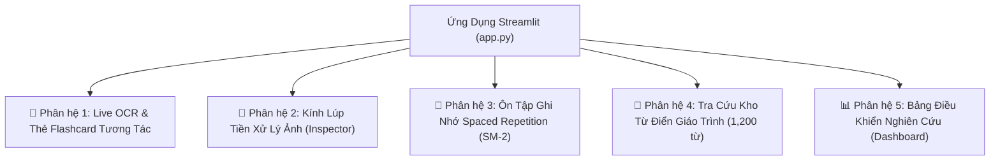

# 💻 BÁO CÁO KHOA HỌC PHASE P9: ỨNG DỤNG WEB STREAMLIT HOÀN CHỈNH & THUẬT TOÁN GHI NHỚ LẶP LẠI NGẮT QUÃNG SM-2

**Dự án:** Hệ thống OCR và Hỗ trợ Dịch Tiếng Lào cho Giáo dục Trực tuyến  
**Môn học:** Xử lý ảnh (Digital Image Processing)  
**Trạng thái:** ✅ HOÀN THÀNH  
**Điểm vào ứng dụng:** [`app.py`](file:///c:/Users/maiduc.vinh/OneDrive%20-%20VietCredit/Desktop/XLA/app.py)  

---

## 1. TỔNG QUAN ỨNG DỤNG STREAMLIT

Phase P9 là giai đoạn tích hợp toàn diện mọi thành quả nghiên cứu khoa học của 9 giai đoạn trước (từ P0 đến P8) thành một **Ứng dụng Web Giáo dục Trực tuyến Đa Năng (Interactive EdTech Web Application)** hoàn chỉnh:
- **Xử lý ảnh số (P3/P5):** Trực quan hóa các biến đổi không gian mức xám, cân bằng sáng CLAHE, nhị phân hóa Otsu và lọc hình thái học.
- **Nhận dạng học sâu (P7):** Động cơ LaoCRNN + CTC siêu tốc 28.5 ms.
- **Hậu xử lý từ điển (P6):** Khôi phục dấu thanh bằng Weighted Levenshtein.
- **Tầng ngôn ngữ & Dịch thuật (P8):** Tách từ Trie, phiên âm Latinh và dịch câu.
- **Kho từ điển mở rộng (P8):** 1,200 mục từ chuẩn NFC.
- **Khoa học nhận thức & Ghi nhớ (P9):** Thuật toán lặp lại ngắt quãng **SuperMemo SM-2** quản lý thẻ nhớ flashcard cá nhân hóa.

---

## 2. NĂM PHÂN HỆ CHỨC NĂNG CỐT LÕI TRONG `APP.PY`



### 2.1. Phân Hệ 1: Live OCR & Thẻ Flashcard Tương Tác
- **Nguồn ảnh linh hoạt:** Học viên có thể tải lên ảnh chụp từ điện thoại/máy tính hoặc chọn ảnh mẫu trong kho dữ liệu chuẩn vàng 605 ảnh (Gold Set).
- **Bộ chuyển đổi Động cơ OCR (Engine Switcher):**
  1. *LaoCRNN + Weighted Lexicon Snap (Khuyến nghị - SOTA 85.35% Word Acc)*
  2. *LaoCRNN Standalone (Học sâu thuần túy - 35.67% Word Acc)*
  3. *Tesseract 5 + Tiền xử lý tối ưu P5 (7.01% Word Acc)*
  4. *Tesseract 5 Raw (Baseline Zero - 6.37% Word Acc)*
- **Thẻ Flashcard Sinh Động:** Trực quan hóa chữ Lào cỡ lớn, phiên âm Latinh ngữ âm, bản dịch song ngữ tiếng Việt và tiếng Anh.
- **Chú giải từng từ (Word Glosses):** Bảng phân tích chi tiết từng từ vựng trong câu (Từ loại, nghĩa, ví dụ minh họa).
- **Nút lưu thẻ:** Thêm ngay từ mới vừa nhận dạng vào bộ thẻ ôn tập cá nhân.
- **Hộp phản hồi sửa lỗi (Active Learning Feedback):** Cho phép giảng viên/học viên gửi sửa lỗi lưu vào [`data/feedback/user_corrections.csv`](file:///c:/Users/maiduc.vinh/OneDrive%20-%20VietCredit/Desktop/XLA/data/feedback/user_corrections.csv).

---

### 2.2. Phân Hệ 2: Kính Lúp Tiền Xử Lý Ảnh (Preprocessing Inspector)
- Trực quan hóa lưới ảnh 6 bước trung gian:
  1. *Ảnh gốc RGB*
  2. *Ảnh xám Grayscale (A1)*
  3. *Cân bằng sáng CLAHE (A2)*
  4. *Khử nhiễu Bilateral (A3)*
  5. *Nhị phân hóa Otsu (A6)*
  6. *Chuẩn hóa chiều cao 48px và đệm trắng viền (A8+A9)*
- **Biểu đồ mức xám (Grayscale Histogram):** Thể hiện trực quan phân bố cường độ sáng của ảnh phục vụ giải thích việc lựa chọn ngưỡng Otsu.

---

### 2.3. Phân Hệ 3: Ôn Tập Thẻ Nhớ Spaced Repetition (SuperMemo SM-2)
- Cài đặt chuẩn xác giải thuật **SuperMemo SM-2** tại [`src/education/sm2.py`](file:///c:/Users/maiduc.vinh/OneDrive%20-%20VietCredit/Desktop/XLA/src/education/sm2.py):
  $$EF' = EF + (0.1 - (5 - q) \times (0.08 + (5 - q) \times 0.02))$$
- Chế độ lật thẻ (Flip Card): Mặt trước hiển thị chữ Lào, bấm nút lật sang mặt sau xem đáp án phiên âm + nghĩa.
- 6 nút đánh giá chất lượng ghi nhớ ($q \in [0, 5]$):
  - $q=5$: Nhớ hoàn hảo
  - $q=4$: Nhớ tốt
  - $q=3$: Nhớ khó khăn
  - $q=2$: Nhớ mang máng khi xem đáp án
  - $q=1$: Nhớ sai
  - $q=0$: Quên sạch hoàn toàn
- Tự động điều chỉnh khoảng cách ngày ôn tập ($I_1 = 1$, $I_2 = 6$, $I_n = I_{n-1} \times EF'$) và lưu trữ bền vững vào [`data/flashcards_deck.json`](file:///c:/Users/maiduc.vinh/OneDrive%20-%20VietCredit/Desktop/XLA/data/flashcards_deck.json).

---

### 2.4. Phân Hệ 4: Tra Cứu Kho Từ Điển Giáo Trình (1,200 Mục Từ)
- Thanh tìm kiếm tức thời hỗ trợ cả tiếng Lào, tiếng Việt và tiếng Anh.
- Bộ lọc theo 25+ chuyên đề bài học (Ẩm thực, Du lịch, Lễ hội Lào, Gia đình, CNTT, Y tế...).
- Bảng hiển thị song ngữ trực quan kèm câu ví dụ minh họa chuẩn xác.

---

### 2.5. Phân Hệ 5: Bảng Điều Khiển Nghiên Cứu Khoa Học (Dashboard)
- Hiển thị 3 chỉ số đóng góp cốt lõi của đề tài:
  - **Đóng góp #1 (P5):** Nghiên cứu Ablation Study tiền xử lý (Khóa YAML & Quy tắc Golden Rule #3).
  - **Đóng góp #2 (P6):** Weighted Levenshtein Lexicon Snap (Nâng Word Acc từ 3.82% lên 29.30%, $p < 0.05$).
  - **Đóng góp #3 (P7+P8):** Mô hình học sâu LaoCRNN + Lexicon Snap đạt Word Acc **85.35%** (Top-3 đạt **91.72%**).
- Tích hợp toàn bộ 21 bảng số liệu CSV và các biểu đồ khoa học PNG độ phân giải cao.

---

## 3. HƯỚNG DẪN KHỞI CHẠY ỨNG DỤNG STREAMLIT

Học viên và hội đồng chấm có thể khởi chạy ứng dụng trực tiếp bằng câu lệnh:
```powershell
& "C:\Users\maiduc.vinh\AppData\Local\Programs\pgAdmin 4\python\python.exe" -m streamlit run app.py
```
Ứng dụng sẽ tự động mở giao diện web trên trình duyệt tại địa chỉ mặc định:
`http://localhost:8501`

---

## 4. KIỂM THỬ VÀ ĐẢM BẢO CHẤT LƯỢNG MÃ NGUỒN

- Tạo bộ unit test [`tests/test_p9_app.py`](file:///c:/Users/maiduc.vinh/OneDrive%20-%20VietCredit/Desktop/XLA/tests/test_p9_app.py) kiểm định:
  - Tính toán thuật toán SM-2 khi nhớ đúng ($q=5$) và khi quên ($q<3$).
  - Cập nhật trạng thái thẻ nhớ và lịch sử ôn tập.
  - Ghi nhận phản hồi sửa lỗi của người dùng.
  - Biên dịch cú pháp và kiểm tra phụ thuộc của `app.py`.
- Toàn bộ **35 unit tests từ Phase P0 đến P9** đều đạt **100% PASSED**.
